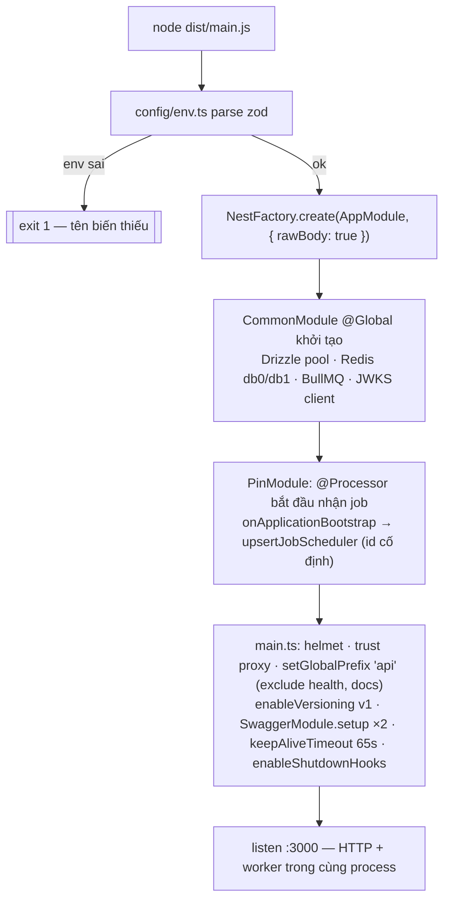
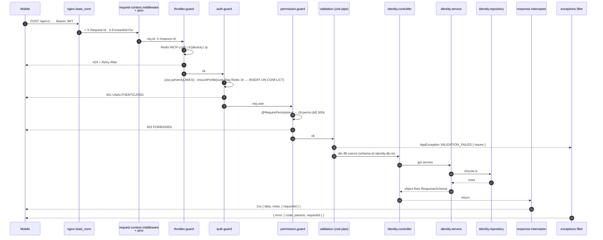
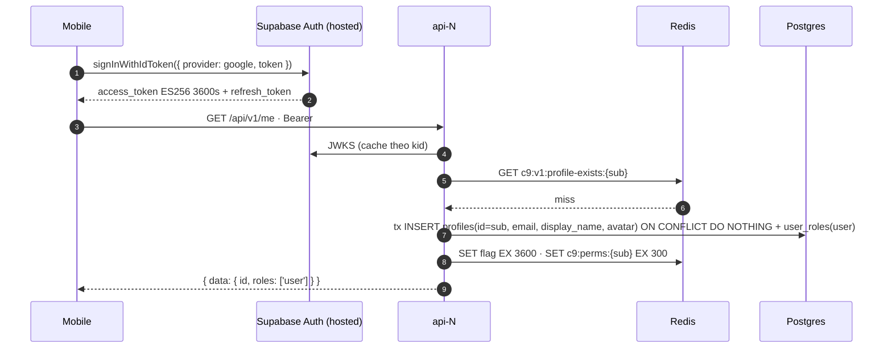
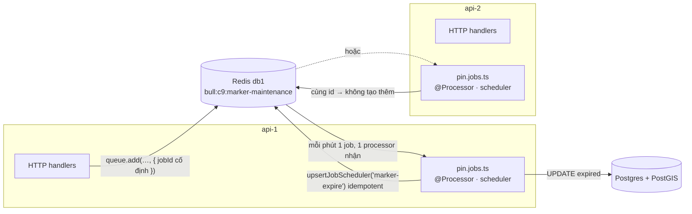
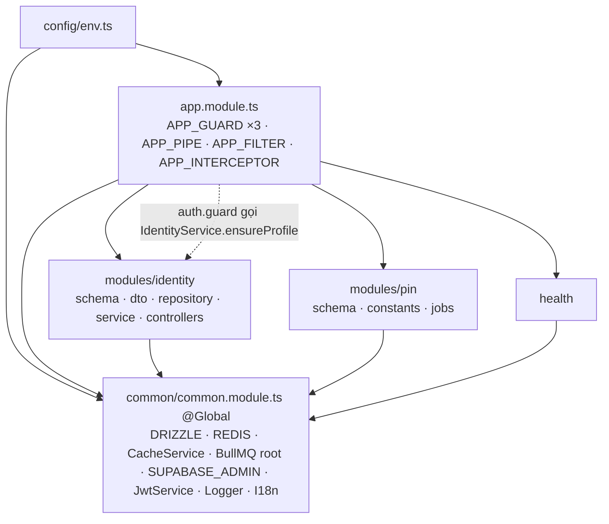
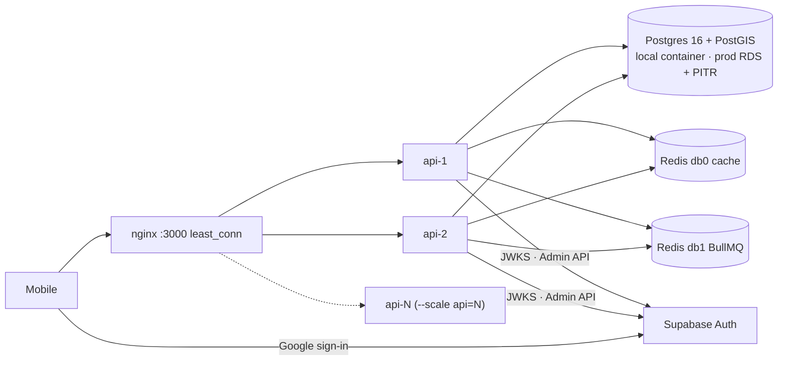

# Cấu trúc & luồng đi — C9 Map backend (NestJS 12, all-in-one)

**Cập nhật:** 2026-09-16 · **Trạng thái:** Active · **Chủ sở hữu:** Tech Lead
Bản vẽ cây thư mục theo [ADR-0006](./adr/0006-all-in-one-cau-truc-don-gian.md) (một project, không `APP_ROLE`, scale bằng số instance), lý do từng file, và 5 luồng cơ chế. Cấu hình từng tầng: [system-architecture.md](./system-architecture.md); thứ tự dựng: [setup-strategy.md](./setup-strategy.md).

---

## 1. Cây thư mục — 6 thư mục trong `src/`

```
c9_map/
├── src/
│   ├── main.ts                       # bootstrap duy nhất: env → app → helmet, prefix /api, v1, swagger ×2, keepAlive 65s, shutdown hooks, listen
│   ├── app.module.ts                 # imports CommonModule + IdentityModule + PinModule + HealthModule
│   │                                 # providers: APP_GUARD Throttler → Auth → Permission · APP_PIPE · APP_FILTER · APP_INTERCEPTOR
│   │                                 # configure(): RequestContextMiddleware forRoutes('*')
│   ├── config/
│   │   └── env.ts                    # zod schema → `env` có kiểu, parse 1 lần lúc boot, fail-fast
│   ├── common/                       # hạ tầng dùng chung — phẳng, 1 file = 1 việc, KHÔNG import modules/
│   │   ├── common.module.ts          # @Global: gom provider DRIZZLE, REDIS_CACHE, REDIS_QUEUE, CacheService, SUPABASE_ADMIN, SupabaseJwtService
│   │   ├── database.ts               # postgres.js + drizzle, geography customType, uuidv7()
│   │   ├── redis.ts                  # ioredis db0 (cache) · db1 (queue, maxRetriesPerRequest:null) · CacheService · cacheKeys
│   │   ├── queue.ts                  # BullModule.forRoot (db1, prefix c9, defaultJobOptions) · QUEUE names
│   │   ├── supabase.ts               # SUPABASE_ADMIN port + adapter (service_role) · SupabaseJwtService (jose + JWKS)
│   │   ├── auth.guard.ts             # Bearer → verify → ensureProfile → req.user · bỏ qua @Public()
│   │   ├── permission.guard.ts       # @RequirePermissions ↔ c9:perms:{id} (300 s) → DB khi miss
│   │   ├── throttler.guard.ts        # tracker u:{id} → d:{device} → ip: · storage Redis · skip health/docs
│   │   ├── decorators.ts             # Public · RequirePermissions · CurrentUser (Reflector.createDecorator)
│   │   ├── exceptions.ts             # ErrorCodes · AppException · AllExceptionsFilter → { error: { code, params, requestId } }
│   │   ├── validation.ts             # APP_PIPE = StandardSchemaValidationPipe({ exceptionFactory → VALIDATION_FAILED })
│   │   ├── response.ts               # ResponseInterceptor { data, meta } · envelope schema · cursor pagination
│   │   ├── request-context.middleware.ts  # X-Instance-Id (INSTANCE_ID) · X-Request-Id (nginx hoặc uuidv7)
│   │   ├── logger.ts                 # nestjs-pino: genReqId · redact · customProps instance/userId · bỏ log /health
│   │   ├── i18n.ts                   # nestjs-i18n: vi mặc định · resolver user.locale → Accept-Language
│   │   └── openapi.ts                # 2 DocumentBuilder (app, admin) · include: · jsonDocumentUrl · exportOpenApi()
│   ├── health/
│   │   ├── health.controller.ts      # GET /health/live · GET /health/ready (ngoài prefix /api, @Public, @SkipThrottle)
│   │   └── health.indicators.ts      # DrizzleHealthIndicator · RedisHealthIndicator (HealthIndicatorService v12)
│   └── modules/                      # nghiệp vụ — mỗi module 1 thư mục, file luôn bắt đầu bằng tên module
│       ├── identity/
│       │   ├── identity.module.ts
│       │   ├── identity.controller.ts        # GET/DELETE /api/v1/me
│       │   ├── identity-admin.controller.ts  # GET /admin/roles · GET/PUT /admin/users/:id/roles (@RequirePermissions('role:manage'))
│       │   ├── identity.service.ts           # ensureProfile · getMe · deleteMe · touchDevice · getPermissions · setUserRoles
│       │   ├── identity.repository.ts        # mọi SQL của identity (Drizzle)
│       │   ├── identity.schema.ts            # profiles · roles · permissions · role_permissions · user_roles · devices
│       │   └── identity.dto.ts               # MeResponseSchema · SetUserRolesSchema (zod)
│       └── pin/
│           ├── pin.module.ts                 # BullModule.registerQueue(MARKER_MAINTENANCE) · providers PinJobs
│           ├── pin.schema.ts                 # markers (gđ sau) — phase skeleton chỉ có queue
│           ├── pin.constants.ts              # tuổi thọ mặc định, rate limit, tier rep (hằng số nghiệp vụ)
│           └── pin.jobs.ts                   # @Processor(MARKER_MAINTENANCE) + onApplicationBootstrap → upsertJobScheduler
├── drizzle/
│   ├── 0000_extensions.sql               # CREATE EXTENSION postgis, unaccent, pg_trgm
│   ├── 0001_identity.sql                 # drizzle-kit generate
│   └── 0002_seed_rbac.sql                # roles / permissions / role_permissions — idempotent
├── drizzle.config.ts                     # schema: 'src/**/*.schema.ts' · out: drizzle/
├── test/
│   ├── setup/{containers.ts, migrate.ts} # testcontainers PostGIS 16-3.4 + Redis 7 → migrate
│   ├── contracts/supabase-admin.contract.ts   # cùng bộ test cho adapter thật và mock
│   ├── mocks/in-memory-supabase-admin.ts
│   ├── integration/*.int.spec.ts         # database · identity · cache · throttle · scheduler
│   └── e2e/*.e2e.spec.ts                 # app (AuthGuard override) · auth-me (skip nếu thiếu SUPABASE_*)
├── scripts/{smoke-multi-instance.sh, dev-token.mjs}
├── i18n/{vi,en}/common.json
├── openapi/{app.json, admin.json}        # CI sinh → mobile codegen
├── Dockerfile                            # multi-stage node:22-alpine · nest build → dist/main.js · USER node · HEALTHCHECK
├── docker-compose.yml                    # postgres (postgis/postgis:16-3.4) · redis:7 · api-1 · api-2 · nginx
├── nginx.conf                            # least_conn · keepalive 32 · X-Request-Id · X-Forwarded-For
├── vitest.config.ts · .env.example · .github/workflows/ci.yml
└── package.json · tsconfig.json · nest-cli.json (mặc định `nest new`)
```

Unit test `*.spec.ts` nằm cạnh file được test. Module mới = copy cấu trúc `identity/`.

## 2. File — có gì, chặn lỗi gì

| File | Có gì | Chặn lỗi gì / vì sao |
|---|---|---|
| `config/env.ts` | zod schema, `env` parse 1 lần, `ConfigModule.forRoot({ validationSchema })` | Thiếu/sai biến → thoát lúc boot với tên biến; mọi nơi đọc `env.X` có kiểu, không `process.env` rải rác |
| `app.module.ts` | Import modules + **toàn bộ** enhancer toàn cục theo thứ tự | Thứ tự guard nhìn thấy một chỗ; test `overrideProvider` được vì dùng token `APP_*`, không `app.useGlobal*` |
| `common/common.module.ts` | `@Global()` gom provider hạ tầng | Feature module không phải import 6 module hạ tầng; chỉ 1 chỗ được `@Global` |
| `common/redis.ts` | 2 connection db0/db1 | Eviction cache không được đụng job BullMQ |
| `common/exceptions.ts` | `ErrorCodes` + filter | Mọi lỗi cùng shape, client dịch mã; không câu tiếng Việt từ server |
| `common/validation.ts` | pipe zod có sẵn Nest 12 | Không class-validator, không nestjs-zod; schema đặt trên `@Body({ schema })` |
| `common/openapi.ts` | 2 document qua `include:` | Admin API không lộ cho app; `openapi/*.json` cho mobile |
| `modules/<x>/<x>.schema.ts` | Bảng Drizzle của module | Mở thư mục module thấy đủ bảng + DTO + logic; `drizzle-kit` gom bằng glob |
| `modules/<x>/<x>.jobs.ts` | Processor + scheduler | Cùng process với API (all-in-one); `upsertJobScheduler` id cố định → N instance chỉ 1 lịch |
| `drizzle/*.sql` | Migration | Chạy bằng `npm run db:migrate` **trước** deploy, không lúc boot (N instance sẽ đua) |
| `docker-compose.yml` | postgres + redis + api ×2 + nginx | Dev luôn ≥ 2 instance để bug "state trong RAM" lộ ngay; PostGIS vì dữ liệu vị trí |
| `nginx.conf` | `least_conn`, sinh `$request_id` | Không `ip_hash` (che bug); request-id có từ biên |
| `vitest.config.ts` | unit / integration / e2e | Integration dùng PostGIS thật; unit không cần Docker |
| `.github/workflows/ci.yml` | lint → typecheck → unit → integration → build → openapi | Mọi PR xanh trước khi có business module |

## 3. Luồng 1 — Bootstrap (một process làm tất cả)



Không có nhánh vai trò. Mỗi container giống hệt nhau; thêm tải = thêm container sau nginx.

## 4. Luồng 2 — Một request đi qua đâu



## 5. Luồng 3 — Đăng nhập Google, profile lần đầu



Backend không tham gia OAuth. Không trigger DB (Postgres và Supabase là hai database). Upsert idempotent nên hai instance nhận request đầu cùng lúc vẫn chỉ một profile.

## 6. Luồng 4 — Job nền trên N instance giống nhau



Mọi instance vừa phục vụ HTTP vừa chạy processor. Khi push fan-out làm p95 API tăng, thêm một biến env để tắt processor trên nhóm instance HTTP — lúc đó mới cần, không phải bây giờ.

## 7. Luồng 5 — Ai import ai



Một chiều: `modules/` và `health/` dùng `common/`; `common/` không biết `modules/`. `auth.guard.ts` cần `ensureProfile` → guard nhận `IdentityService` qua DI từ `AppModule` (IdentityModule export service), không import file trong `modules/` từ `common/`.

## 8. Luồng 6 — Hạ tầng



## 9. Đọc tiếp
- Từng phase có lệnh "done": `plans/260916-1500-c9-map-backend-skeleton/`
- Vì sao chọn từng cấu hình: [setup-strategy.md](./setup-strategy.md)
- Quy tắc khi thêm file: [code-standards.md](./code-standards.md) §2–§5
