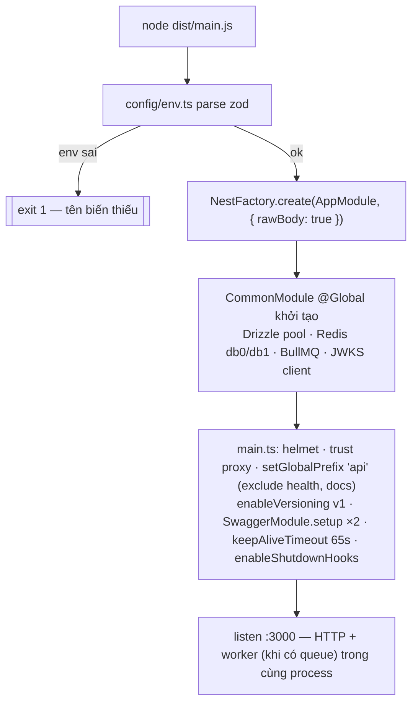
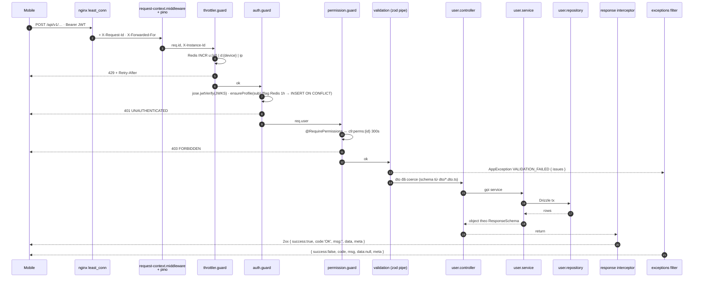
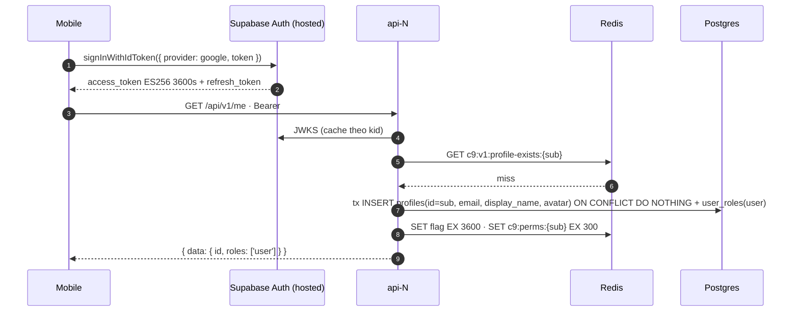
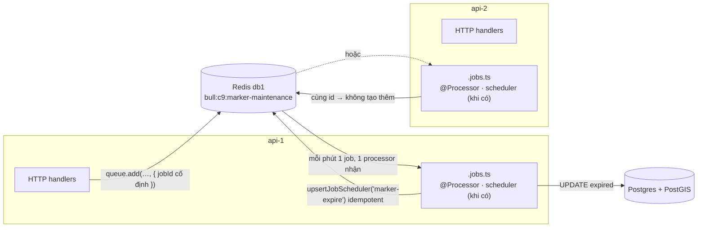
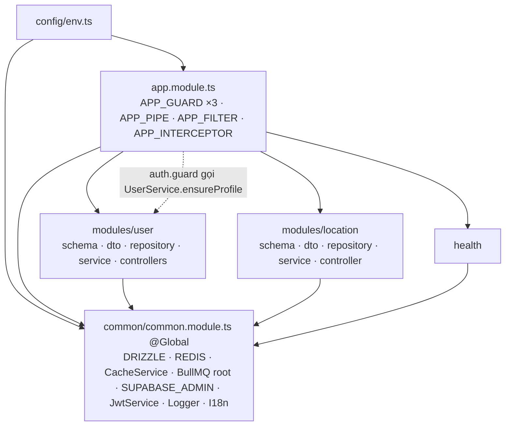
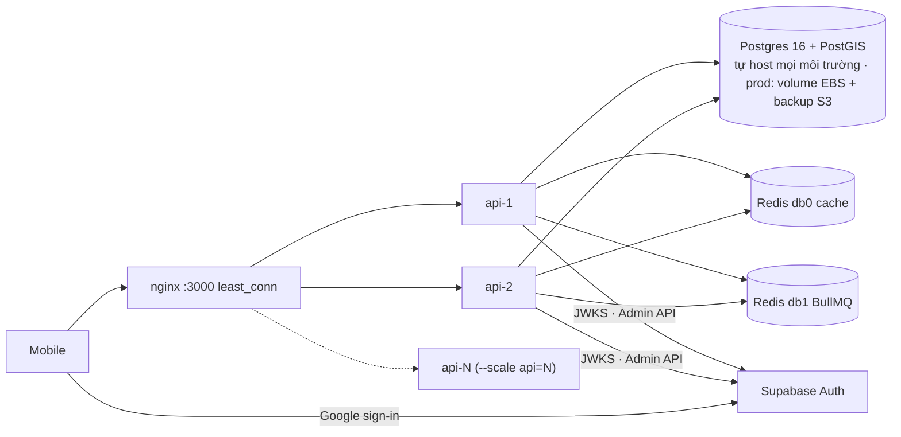

# Cấu trúc & luồng đi — C9 Map backend (NestJS 12, all-in-one)

**Cập nhật:** 2026-09-17 · **Trạng thái:** Active · **Chủ sở hữu:** Tech Lead
Bản vẽ cây thư mục theo [ADR-0006](./adr/0006-all-in-one-cau-truc-don-gian.md) (một project, không `APP_ROLE`, scale bằng số instance), lý do từng file, và 5 luồng cơ chế. Cấu hình từng tầng: [system-architecture.md](./system-architecture.md); thứ tự dựng: [setup-strategy.md](./setup-strategy.md).

---

## 1. Cây thư mục

```
c9_map/
├── src/
│   ├── instrument.ts                 # Sentry.init khi có SENTRY_DSN; nạp bằng `node --import` trước app
│   ├── main.ts                       # điểm vào server: createApp → Swagger UI → listen
│   ├── app.ts                        # createApp(): helmet · trust proxy · prefix /api · version v1 · shutdown hooks (dùng chung với openapi-export)
│   ├── app.module.ts                 # imports ConfigModule + CommonModule + modules; providers APP_GUARD Throttler → Auth → Permission · APP_PIPE · APP_FILTER · APP_INTERCEPTOR
│   ├── openapi-export.ts             # `npm run openapi:export` → openapi/<key>.json mỗi định nghĩa (users, locations, health)
│   ├── config/                       # cấu hình app — không nghiệp vụ, không hạ tầng
│   │   ├── env.ts                    # zod schema; ConfigModule đọc .env + validate, dùng qua ConfigService
│   │   ├── logger.ts                 # nestjs-pino: genReqId · redact · bỏ log /health
│   │   ├── i18n.ts                   # nestjs-i18n vi/en, resolver Accept-Language
│   │   └── openapi.ts                # định nghĩa theo module (OPENAPI_DOCS) · tự ghi quyền/public · envelope() · exportOpenApi()
│   ├── common/                       # hạ tầng dùng chung, gom theo mối quan tâm — KHÔNG import modules/
│   │   ├── common.module.ts          # @Global: DRIZZLE · REDIS_CACHE · CacheService · SUPABASE_ADMIN · SupabaseJwtService; imports QueueRoot, Throttler
│   │   ├── auth/
│   │   │   ├── auth.guard.ts         # Bearer → JWKS → ensureProfile → req.user · bỏ qua @Public() · AUTH_USER port
│   │   │   ├── permission.guard.ts   # @RequirePermissions ↔ cache c9:perms:{id}
│   │   │   ├── supabase.ts           # SupabaseJwtService (jose + JWKS, ES256/RS256) · SUPABASE_ADMIN port + adapter
│   │   │   └── decorators.ts         # Public · RequirePermissions · CurrentUser
│   │   ├── database/
│   │   │   ├── drizzle.ts            # provider DRIZZLE (postgres.js + drizzle client)
│   │   │   ├── columns.ts            # cột dùng chung cho *.schema.ts: timestamps · uuidV7Pk · geographyPoint (lat/lng ↔ EWKT/EWKB)
│   │   │   └── schema.ts             # barrel gom *.schema.ts của mọi module
│   │   ├── redis/
│   │   │   ├── redis.provider.ts     # provider REDIS_CACHE (db0) · redisOptions()
│   │   │   ├── cache.ts              # CACHE (key + ttl từng mục) · CacheService (5 thao tác)
│   │   │   ├── queue.ts              # BullModule.forRoot (db1, prefix c9) · QUEUES
│   │   │   └── throttler.guard.ts    # RedisThrottlerStorage (Lua) · AppThrottlerGuard tracker u:/d:/ip:
│   │   └── http/
│   │       ├── exceptions.ts         # ErrorCodes · AppException · AllExceptionsFilter → { success:false, code, msg, data:null, meta }
│   │       ├── response.ts           # ResponseInterceptor → { success, code, msg, data, meta }
│   │       ├── pagination.ts         # cursor (created_at, id) · PaginationQuerySchema · pageOf()
│   │       ├── validation.ts         # APP_PIPE StandardSchemaValidationPipe (zod) → 422 · zText · zLatLng
│   │       ├── request-context.middleware.ts  # X-Instance-Id · X-Request-Id
│   │       └── express.d.ts          # req.user
│   └── modules/                      # nghiệp vụ — mỗi module 1 thư mục; file chính ở gốc, chỉ 2 thư mục con dto/ và schema/
│       ├── health/
│       │   ├── health.module.ts · health.controller.ts (GET /health/live · /health/ready) · health.indicators.ts
│       ├── user/
│       │   ├── user.module.ts
│       │   ├── user.controller.ts        # UserController GET/DELETE /me · UserAdminController /admin/roles (@RequirePermissions)
│       │   ├── user.service.ts           # ensureProfile · getMe · deleteMe · touchDevice · getPermissions · setUserRoles
│       │   ├── user.repository.ts        # mọi SQL của user (Drizzle)
│       │   ├── dto/                          # zod request/response — Swagger đọc tự động
│       │   │   ├── me.dto.ts                 # MeResponseSchema
│       │   │   └── role.dto.ts               # ROLE_CODES · RoleSchema · SetUserRolesSchema
│       │   └── schema/
│       │       └── user.schema.ts        # profiles · roles · permissions · role_permissions · user_roles · devices
│       ├── location/                 # MODULE MẪU — copy cấu trúc này cho module mới
│       │   ├── location.module.ts · location.controller.ts · location.service.ts · location.repository.ts · location.constants.ts
│       │   ├── dto/create-location.dto.ts · dto/location.dto.ts     # 1 file / use case, chứa cả request + response
│       │   └── schema/location.schema.ts                          # saved_locations (geography + GIST)
│       └── queue-board/
│           └── queue-board.module.ts # /admin/queues (Bull Board) + middleware JWT + queue:read; tắt khi test
├── drizzle/                          # 0000_extensions · 0001_identity · 0002_seed_rbac · 0003_location · 0004_location-public
├── drizzle.config.ts                 # schema: 'src/**/*.schema.ts'
├── test/
│   ├── unit/*.spec.ts                # logic thuần, không hạ tầng (env · exceptions · columns · permission.guard · pagination · validation · location.service)
│   ├── integration/*.spec.ts         # AppModule thật trên testcontainers (app · cross-cutting · geography · redis-queue · auth-rbac · location · supabase-real)
│   └── setup/{containers,env,jwks}.ts # globalSetup testcontainers + migrate · setupFiles inject URL · Supabase JWKS giả (ES256)
├── scripts/                          # smoke-multi-instance.sh · dev-token.mjs · verify-auth.mjs
├── i18n/{vi,en}/*.json · openapi/{users,locations,health}.json
├── Dockerfile · docker-compose.yml · nginx.conf · vitest.config.ts · .env.example · .github/workflows/ci.yml
└── package.json · tsconfig.json · nest-cli.json
```

Người mới đọc [code-walkthrough.md](./code-walkthrough.md) trước. Module mới = copy cấu trúc `location/` (`nest g resource <x> modules` sinh đúng bố cục này, chỉ đổi `entities/` → `schema/`).

## 2. File — có gì, chặn lỗi gì

| File | Có gì | Chặn lỗi gì / vì sao |
|---|---|---|
| `config/env.ts` | zod schema + `ConfigModule.forRoot({ validationSchema })` | Thiếu/sai biến → thoát lúc boot với tên biến; mọi nơi đọc qua `ConfigService.get(..., { infer: true })`, không `process.env` rải rác |
| `app.module.ts` | Import modules + **toàn bộ** enhancer toàn cục theo thứ tự | Thứ tự guard nhìn thấy một chỗ; test `overrideProvider` được vì dùng token `APP_*`, không `app.useGlobal*` |
| `common/common.module.ts` | `@Global()` gom provider hạ tầng | Feature module không phải import 6 module hạ tầng; chỉ 1 chỗ được `@Global` |
| `common/redis/redis.provider.ts` · `queue.ts` | db0 cho cache, db1 cho BullMQ | Eviction cache không được đụng job BullMQ |
| `common/http/exceptions.ts` | `ErrorCodes` + filter dịch `msg` qua i18n | Mọi response cùng shape `{ success, code, msg, data, meta }`; câu chữ chỉ ở `i18n/*/errors.json`, không trong service |
| `common/http/validation.ts` | pipe zod có sẵn Nest 12 | Không class-validator, không nestjs-zod; schema đặt trên `@Body({ schema })` |
| `config/openapi.ts` | Một document mỗi module qua `include:` | Dropdown chọn module; `openapi/<module>.json` cho mobile codegen |
| `modules/<x>/<x>.schema.ts` | Bảng Drizzle của module | Mở thư mục module thấy đủ bảng + DTO + logic; `drizzle-kit` gom bằng glob |
| `modules/<x>/<x>.jobs.ts` | Processor + scheduler | Cùng process với API (all-in-one); `upsertJobScheduler` id cố định → N instance chỉ 1 lịch |
| `drizzle/*.sql` | Migration | Chạy bằng `npm run db:migrate` **trước** deploy, không lúc boot (N instance sẽ đua) |
| `docker-compose.yml` | postgres + redis + api ×2 + nginx | Dev luôn ≥ 2 instance để bug "state trong RAM" lộ ngay; PostGIS vì dữ liệu vị trí |
| `nginx.conf` | `least_conn`, sinh `$request_id` | Không `ip_hash` (che bug); request-id có từ biên |
| `vitest.config.ts` | 2 project: unit / integration | Integration dùng PostGIS thật; unit không cần Docker |
| `.github/workflows/ci.yml` | lint → typecheck → unit → integration → build → openapi | Mọi PR xanh trước khi có business module |

## 3. Luồng 1 — Bootstrap (một process làm tất cả)



Không có nhánh vai trò. Mỗi container giống hệt nhau; thêm tải = thêm container sau nginx.

## 4. Luồng 2 — Một request đi qua đâu



## 5. Luồng 3 — Đăng nhập Google, profile lần đầu



Backend không tham gia OAuth. Không trigger DB (Postgres và Supabase là hai database). Upsert idempotent nên hai instance nhận request đầu cùng lúc vẫn chỉ một profile.

## 6. Luồng 4 — Job nền trên N instance giống nhau



Mọi instance vừa phục vụ HTTP vừa chạy processor. Khi push fan-out làm p95 API tăng, thêm một biến env để tắt processor trên nhóm instance HTTP — lúc đó mới cần, không phải bây giờ.

## 7. Luồng 5 — Ai import ai



Một chiều: `modules/` và `health/` dùng `common/`; `common/` không biết `modules/`. `auth.guard.ts` cần `ensureProfile` → guard nhận `UserService` qua DI từ `AppModule` (UserModule export service), không import file trong `modules/` từ `common/`.

## 8. Luồng 6 — Hạ tầng



## 9. Đọc tiếp
- Từng phase có lệnh "done": `plans/260916-1500-c9-map-backend-skeleton/`
- Vì sao chọn từng cấu hình: [setup-strategy.md](./setup-strategy.md)
- Quy tắc khi thêm file: [code-standards.md](./code-standards.md) §2–§5
